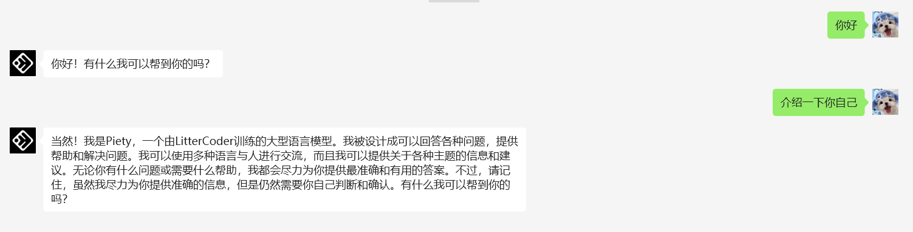

# wx-ai
基于微信功能集成AI助手.后续会添加更多大模型及stalbe diffusian基础上微调的各种好玩应用


# 主要功能及后续计划
 1. 大模型RAG知识库功能
 2. 大模型agent智能体功能
 3. 大模型lora微调高级功能
 4. stable diffusian高级微调功能
 5. 生成视频好玩功能

# 使用示例

①GPT对话




# 部署方式

## 1.运行环境

支持 Linux、MacOS、Windows 系统（可在Linux服务器上长期运行)，同时需安装 `Python`。

> 建议Python版本在 3.7.1~3.9.X 之间，推荐3.8版本，3.10及以上版本在 MacOS 可用，其他系统上不确定能否正常运行。

**(1) 克隆项目代码：**

```bash
git clone https://github.com/heawon-yoon/wx-ai.git
cd wx-ai/
```

**(2) 安装核心依赖 ：**

```bash
pip3 install -r requirements.txt
```

## 2.配置


然后在`config.json`中填入配置，以下是对默认配置的说明，可根据需要进行自定义修改（请去掉注释）：

```shell
# config.json文件内容示例
{
  "channel_type": "wx",
  "model": "gpt-3.5-turbo-16k", #模型名称
  "open_ai_api_key": "XXXXX", #openai key
  "open_ai_api_base": "https://api.openai.com/v1", #openai url
}
```
## openai 
如果没有openai_key 可以使用这里的账号.无需翻墙,直接注册使用
[openai注册](https://openai.vikpay.com)
下面是使用示例
```
# config.json文件内容示例
{
  "model": "gpt-3.5-turbo-16k", #支持各种大模型
  "open_ai_api_key": "XXXXX", #key注册后可以获取
  "open_ai_api_base": "https://openai.vikpay.com/api", #openai url
}
```

## 3.运行

### 1.本地运行

如果是开发机 **本地运行**，直接在项目根目录下执行：

```shell
python3 app.py
```

终端输出二维码后，使用微信进行扫码，当输出 "Start auto replying" 时表示自动回复程序已经成功运行了（注意：用于登录的微信需要在支付处已完成实名认证）。扫码登录后你的账号就成为机器人了，可以在微信手机端通过配置的关键词触发自动回复 (任意好友发送消息给你，或是自己发消息给好友)

### 2.服务器部署

使用nohup命令在后台运行程序：

```
nohup python3 app.py > out.log 2>&1 & tail -f out.log      
# 在后台运行程序并通过日志输出二维码
```

## Acknowledgements

在这个项目基础是开发的 [chatgpt-on-wechat](https://github.com/zhayujie/chatgpt-on-wechat)


# 联系我们

问题咨询和商务合作可联系

 